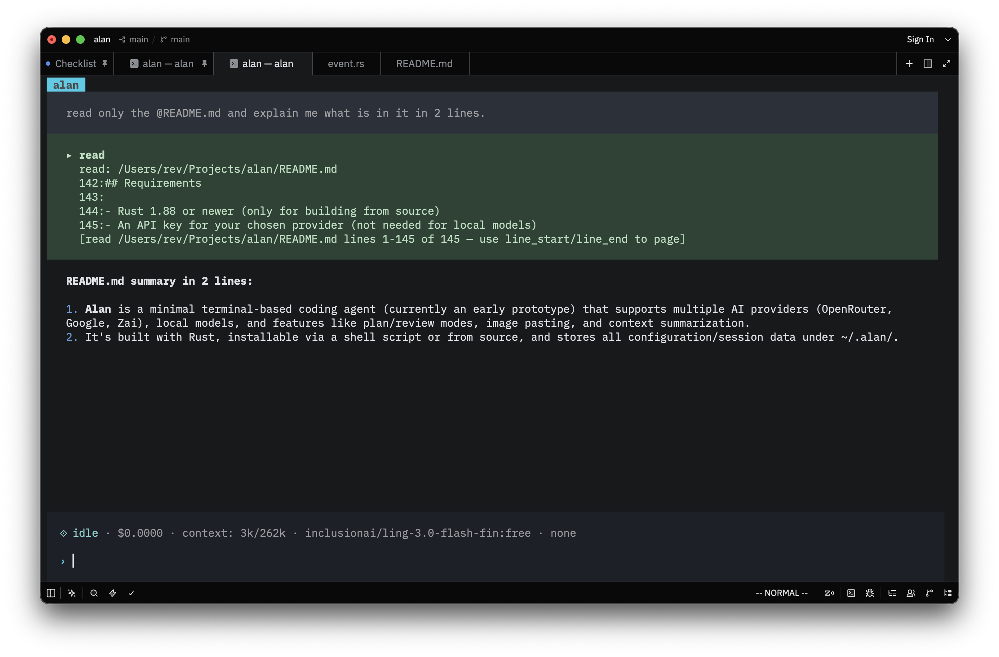

# Alan

A minimal coding agent in your terminal.

> Alan is currently an early prototype. Some features are still being developed, and behavior may change between releases.

 

## Table of Contents

- [Features](#features)
- [Installation](#installation)
- [Providers](#providers)
- [Usage](#usage)
- [Permissions](#permissions)
- [Local models](#local-models)
- [Configuration and data locations](#configuration-and-data-locations)
- [Building from source](#building-from-source)
- [Requirements](#requirements)

## Features

- **First-class OpenRouter support** — full model catalog, per-model custom provider pinning (`/model-provider`), and reasoning effort control (`/effort`).
- **Paste images** — drop a screenshot from your clipboard straight into the conversation and ask about it.
- **Compact with focus** — `/summarize-new "focus hint"` summarizes the context and restarts with just what matters.
- **Steering** — queue a message mid-run and the agent picks it up without waiting for the response to finish.
- **Plan and review modes** — cycle through them with `Shift+Tab` when you want the agent to think before it acts.
- **Local models** — point Alan at any OpenAI-compatible endpoint, no API key required.

> Skills support is implemented at the agent level but not exposed in the UI yet — coming soon.

## Installation

Prebuilt binaries are published through GitHub Releases. The installer detects your operating system and CPU architecture, downloads the matching binary, verifies it, and installs `alan` into Cargo's binary directory.

### macOS and Linux

```bash
curl -fsSL https://github.com/Revantark/alan/releases/latest/download/alan-installer.sh | bash
```

Restart your shell or ensure `~/.cargo/bin` is on your `PATH`, then run:

```bash
alan
```

### Windows

Not supported yet.

### Updating

Run the same installer command again to install the latest release. To see the installed version:

```bash
alan --version
```

## Providers

Alan currently supports:

- **OpenRouter**
- **Google** (beta)
- **Zai** (beta)

Use the `/login` command to sign in to any of the available providers.

For OpenRouter, you can pin a custom provider for the selected model with `/model-provider`, followed by the provider name (no quotes):

- `/model-provider deepseek`
- `/model-provider xiaomi/fp8`

## Usage

| Command | Description |
| --- | --- |
| `/models` | Pick a model from the provider catalog |
| `/plan` | Toggle plan mode (also `Shift+Tab`) |
| `/review` | Toggle review mode (also `Shift+Tab`) |
| `/normal` | Turn off plan and review mode |
| `/login` | Sign in to a provider interactively |
| `/new` | Start a fresh session |
| `/summarize-new [focus]` | Summarize the context and restart; optionally pass a quoted focus hint, e.g. `/summarize-new "just take the XYZ details"` |
| `/effort` | Set reasoning effort (`none`, `minimal`, `low`, `medium`, `high`, `xhigh`, `max`) |
| `/fork` | Fork the session from a checkpoint |
| `/tool-free` | Allow all tool calls without asking |
| `/tool-slip` | Approve a command family once, allow its siblings |
| `/tool-strict` | Allow only exact commands already approved |
| `/local` | Manage local models (add, remove, edit) |
| `/model-provider <name>` | Pin a custom provider for the current OpenRouter model |
| `/help` | List available commands |

## Permissions

Alan provides three policies to handle tool call permissions.

- **◌ Free** — allow every tool call without asking.
- **⟐ Slip** — once a command family (e.g. `bun`) is approved, siblings run without asking.
- **# Strict** — only exact previously-approved commands are allowed; approving an edit tool once unlocks all edit tools (file edits only, not commands).

Grants persist per-project at `~/.alan/projects/<slug>/permissions.json` (base directory respects `ALAN_HOME`). The current policy is shown as a glyph in the status line.

Alan starts in strict policy. Switch with:
  - `/tool-slip`
  - `/tool-free`

## Local models

Alan supports OpenAI-compatible local models.

```bash
/local add
```

This opens an overlay with fields for Model ID, URL, API, and API Key. Use `/local remove` and `/local edit` to manage your local models. No API key or `/login` is needed for local models.

## Configuration and data locations

Alan stores everything under `~/.alan/` by default:

- `settings.json` — your settings.
- `sessions/` — conversation history (append-only JSONL, one file per session).
- `logs/` — daily rotating logs.

All of these locations respect the `ALAN_HOME` environment variable, so you can redirect them if needed. Two other environment variables are useful:

- `ALAN_LOG_DIR` — override the log directory.
- `ALAN_MODEL` — override the default model on startup, e.g. `ALAN_MODEL=openai/gpt-4o-mini alan`.

## Building from source

You'll need Rust 1.88 or newer (see [Requirements](#requirements)).

```bash
git clone https://github.com/Revantark/alan
cd alan
cargo run -p alan
```

## Requirements

- Rust 1.88 or newer (only for building from source)
- An API key for your chosen provider (not needed for local models)
