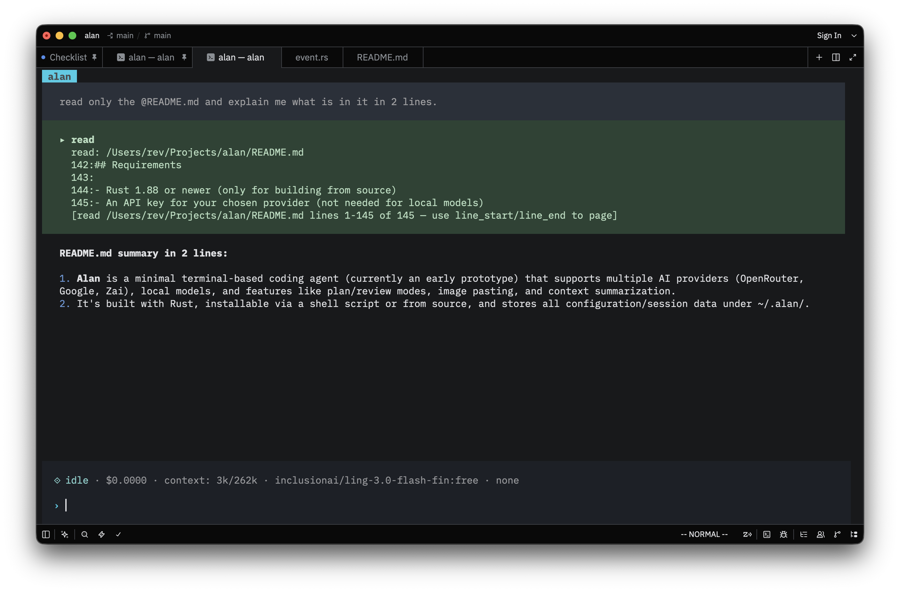

# Alan

A minimal coding agent in your terminal.

> Alan is currently an early prototype. Some features are still being developed, and behavior may change between releases.

 

## Table of Contents

- [Features](#features)
- [Installation](#installation)
- [Providers](#providers)
- [Usage](#usage)
- [Permissions](#permissions)
- [Local models](#local-models)
- [Skills](#skills)
- [Configuration and data locations](#configuration-and-data-locations)
- [Building from source](#building-from-source)
- [Requirements](#requirements)

## Features

- **First-class OpenRouter support** — full model catalog, per-model custom provider pinning (`/model-provider`), and reasoning effort control (`/effort`).
- **Paste images** — drop a screenshot from your clipboard straight into the conversation and ask about it.
- **Compact with focus** — `/summarize-new "focus hint"` summarizes the context and restarts with just what matters.
- **Steering** — queue a message mid-run and the agent picks it up without waiting for the response to finish.
- **Plan and review modes** — cycle through them with `Shift+Tab` when you want the agent to think before it acts.
- **Local models** — point Alan at any OpenAI-compatible endpoint, no API key required.
- **Skills** — type `#name` in the prompt to attach a skill's full instructions to that message.

## Installation

Prebuilt binaries are published through GitHub Releases. The installer detects your operating system and CPU architecture, downloads the matching binary, verifies it, and installs `alan` into Cargo's binary directory.

### macOS and Linux

```bash
curl -fsSL https://github.com/Revantark/alan/releases/latest/download/alan-installer.sh | bash
```

Restart your shell or ensure `~/.cargo/bin` is on your `PATH`, then run:

```bash
alan
```

### Windows

Not supported yet.

### Updating

Run the same installer command again to install the latest release. To see the installed version:

```bash
alan --version
```

## Providers

Alan currently supports:

- **OpenRouter**
- **Google** (beta)
- **Zai** (beta)

Use the `/login` command to sign in to any of the available providers.

For OpenRouter, you can pin a custom provider for the selected model with `/model-provider`, followed by the provider name (no quotes):

- `/model-provider deepseek`
- `/model-provider xiaomi/fp8`

## Usage

| Command | Description |
| --- | --- |
| `/models` | Pick a model from the provider catalog |
| `/profile` | Open the profile picker to switch profiles (`Ctrl+P`, or `Cmd+Option+P` where the terminal passes it through) |
| `/profile save <name>` | Save current model/provider, reasoning, and web settings as a new profile |
| `/profile delete` | Pick a saved profile to delete |
| `/plan` | Toggle plan mode (also `Shift+Tab`) |
| `/review` | Toggle review mode (also `Shift+Tab`) |
| `/normal` | Turn off plan and review mode |
| `/login` | Sign in to a provider interactively |
| `/new` | Start a fresh session |
| `/summarize-new [focus]` | Summarize the context and restart; optionally pass a quoted focus hint, e.g. `/summarize-new "just take the XYZ details"` |
| `/effort` | Set reasoning effort (`none`, `minimal`, `low`, `medium`, `high`, `xhigh`, `max`) |
| `/fork` | Fork the session from a checkpoint |
| `/tool-free` | Allow all tool calls without asking |
| `/tool-slip` | Approve a command family once, allow its siblings |
| `/tool-strict` | Allow only exact commands already approved |
| `/local` | Manage local models (add, remove, edit) |
| `/model-provider <name>` | Pin a custom provider for the current OpenRouter model |
| `/help` | List available commands |

## Permissions

Alan provides three policies to handle tool call permissions.

- **◌ Free** — allow every tool call without asking.
- **⟐ Slip** — once a command family (e.g. `bun`) is approved, siblings run without asking.
- **# Strict** — only exact previously-approved commands are allowed; approving an edit tool once unlocks all edit tools (file edits only, not commands).

A single tool call may chain several commands (`cargo test && cargo run`, or with `||`, `;`, `|`). Each chained command is granted and checked separately, and the call runs only if every one of them is allowed, so approving `cargo test && cargo run` stores two grants and the next call runs without prompting. Splitting is deliberately shallow: subshells, redirections and `$(...)` are not parsed, so such a command stays one opaque grant rather than being partly authorized.

Grants persist per-project at `<data dir>/projects/<pwd-hash>/permissions.json`. The current policy is shown as a glyph in the status line.

Alan starts in strict policy. Switch with:
  - `/tool-slip`
  - `/tool-free`

## Local models

Alan supports OpenAI-compatible local models.

```bash
/local add
```

This opens an overlay with fields for Model ID, URL, API, and API Key. Use `/local remove` and `/local edit` to manage your local models. No API key or `/login` is needed for local models.

## Configuration and data locations

Alan stores everything under `~/.alan/` by default:

- `settings.json` — your current settings and active-profile marker.
- `profiles.json` — saved named model/reasoning/web settings profiles.
- `sessions/` — conversation history (append-only JSONL, one file per session).
- `skills/` — personal skills, available in every project.
- `logs/` — daily rotating logs.

All of these live in the data directory (`~/.alan` by default). `ALAN_HOME` selects the *parent* of that directory, so `ALAN_HOME=/tmp/x` puts everything in `/tmp/x/.alan`. Two other environment variables are useful:

- `ALAN_LOG_DIR` — override the log directory.
- `ALAN_MODEL` — override the default model on startup, e.g. `ALAN_MODEL=openai/gpt-4o-mini alan`.

## Skills

A skill is a folder of instructions for a specific kind of task. Type `#name`
in the prompt to attach one to that message; Alan completes the name as you
type and highlights the token.

Skills live in three places, scanned in this order:

- `<project>/.alan/skills/<name>/SKILL.md` — project skills. Commit these;
  everyone who clones the repo gets them, like `AGENTS.md`.
- `~/.alan/skills/<name>/SKILL.md` — personal skills, shared across projects.
- `~/.agents/skills/<name>/SKILL.md` — skills shared with other agent tools
  (Claude Code, Zed, Codex, and others), so one you write for them is not
  locked to Alan.

An earlier entry shadows a later one with the same name, so a project skill
beats a personal one, and both beat the shared copy. `~/.agents/skills` is
read last so that a skill you maintain for Alan specifically is not silently
replaced by a same-named copy from another tool. The folder name is what
`#name` resolves against.

Each skill is a `SKILL.md` with YAML frontmatter and a body:

```markdown
---
description: Use when shipping a release. Covers the checklist and tag format.
---
Run `scripts/check.sh`, then open a release PR. Never push to `main`.
```

`description` is the only frontmatter key Alan reads, and it is required —
it is the text you pick the skill from, so write it as "use when…". Every
other key is ignored. The folder name, not a `name:` key, is what `#name`
resolves against.

The body is appended in full to the message you attached it to, rather than
being advertised and fetched on demand. That suits manual invocation: you have
already decided the skill is relevant, so there is nothing to save by deferring
the read. The tradeoff is that the body is re-sent on every turn of that
message's session, so keep skills focused.

Two things worth knowing: skills are read once at startup, so editing a
`SKILL.md` takes effect on the next launch; and a `#name` that matches no skill
is left as ordinary text.

## Building from source

You'll need Rust 1.88 or newer (see [Requirements](#requirements)).

```bash
git clone https://github.com/Revantark/alan
cd alan
cargo run -p alan
```

## Requirements

- Rust 1.88 or newer (only for building from source)
- An API key for your chosen provider (not needed for local models)
